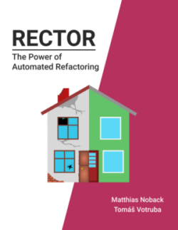

# Improve the next Version of Rector Book

Have you read [Rector - The Power of Automated Refactoring](https://leanpub.com/rector-the-power-of-automated-refactoring) book?



This is repository is a place for your feedback!  

We will release new edition of the book with these fixes, to make the content up to date. **We need your help** to improve the quality and fix the glitches we missed.

## What is Ideal Feedback?

- it has the page number
- diff format of before/after
- 1-2 sentences to explain "why" do you suggest the change, so we can understand it right from your proposal


## What Feedback we Look for?

Here are 3 feedbacks we can integrate in the book:

### 1. A Glitch - [Create](https://github.com/rectorphp/the-power-of-automated-refactoring-feedback/issues/new?assignees=&labels=glitch&template=1_glitch.md)

"On page 43 there is a typo in "coed" word, should be "code"."

### 2. Code Improvement - [Create](https://github.com/rectorphp/the-power-of-automated-refactoring-feedback/issues/new?assignees=&labels=code&template=2_code.md)

"The code on page 12 seems too long for its purpose. Shorted version might keep reader focused on the content instead of dragging PHP syntax."

```diff
-if ($value === 10) {
-    return 'yes'; 
-}
-
-return 'no';
+return $value === 10 ? 'yes' : 'no';
```

### 3. Text Improvement - [Create](https://github.com/rectorphp/the-power-of-automated-refactoring-feedback/issues/new?assignees=&labels=text&template=3_text.md)

"On page 78 the paragraph starting with 'One day we decided...' seems a bit unclear to me. It would help to explain what 3 exact steps we have to do in real project."

<br>

## Thank You

We appreciate your will to help other readers, so they can get better quality content.

Thank you!

[Matthias Noback](https://matthiasnoback.nl/) & [Tomas Votruba](https://tomasvotruba.com/), authors

<br>

## Book and Rector Versions

Version of 1.0 book is released with [Rector 0.11.2](https://github.com/rectorphp/rector/releases/tag/0.11.2) (2021-05-15) and PHP 8.0 (2020-12). 